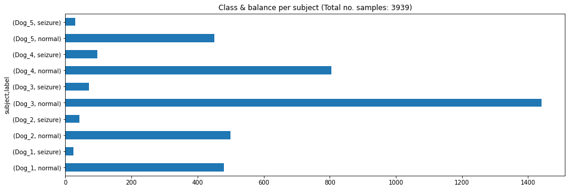
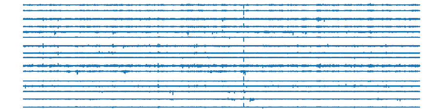

# Prediction of seizures from EEG signals

This [dataset](https://www.kaggle.com/c/seizure-prediction) contains EEG recordings from dogs with naturally occurring epilepsy using an ambulatory monitoring system. EEG was sampled from 16 electrodes at 400 Hz, and recorded voltages were referenced to the group average. These are long duration recordings, spanning multiple months up to a year and recording up to a hundred seizures in some dogs.
The challenge is to distinguish between ten minute long data clips covering an hour prior to a seizure, and ten minute iEEG clips of interictal activity.

The data is stored in a series of .mat files, each containing a data structure with fields as follows:

* data: a matrix of EEG sample values arranged row x column as electrode x time.
* data_length_sec: the time duration of each data row
* sampling_frequency: the number of data samples representing 1 second of EEG data.
* channels: a list of electrode names corresponding to the rows in the data field
* sequence: the index of the data segment within the one hour series of clips. For example, preictal_segment_6.mat has a sequence number of 6, and represents the iEEG data from 50 to 60 minutes into the preictal data.


```python
import numpy as np
import pandas as pd
from tqdm.notebook import tqdm
from scipy import stats
import utils
from feature_extraction import extractFeatures

from sklearn.feature_selection import SelectKBest, f_classif
from sklearn.model_selection import StratifiedKFold, RandomizedSearchCV
from lightgbm import LGBMClassifier as lgb
from sklearn.metrics import roc_auc_score
from sklearn.pipeline import make_pipeline

```

## Light EDA


```python
filedf = utils.indexFiles()

filedf.drop('path', axis = 1).groupby(['subject', 'label']).count().plot(
    kind    = 'barh', 
    figsize = (15, 5),
    legend  = None,
    title   = f'Class & balance per subject (Total no. samples: {filedf.shape[0]})');
```


    


### Plot one entire subject


```python
for subject, df in filedf.groupby('subject'):
    utils.plotSubject(df)
    break
```


      0%|          | 0/504 [00:00<?, ?it/s]


    

    


### No. channels
Get number of channels present in each record:


```python
metadf = []
for idx, record in tqdm(filedf.iterrows(), total = filedf.shape[0]):
    duration, Fs, _, _, signals = utils.parseFile(record['path']) 
    metadf.append((idx, duration, Fs, signals.shape[0], signals.shape[1]))

metadf = pd.DataFrame(metadf, columns = ['idx', 'duration', 'frequency', 'channels', 'samples'])

metadf.groupby('channels')['idx'].count()
```


    channels
    15     480
    16    3459
    Name: idx, dtype: int64


Approximately 10% of the dataset consists of 15 channels. We need to find which are the missing channels:


```python
# Get records with at least one channel missing
missingChIdx = metadf['idx'][metadf['channels'] == 15]
missingChdf = filedf.loc[missingChIdx]

allChannels = range(1, 17) # All channels that should be present
channelsMissing = []

for idx, record in tqdm(missingChdf.iterrows(), total = missingChdf.shape[0]):
    _, _, chNames, _, _ = utils.parseFile(record['path'])
    
    # Channel numbers that are present in the record
    channelsPresent = [int(name.split('_')[-1].strip('c')) for name in chNames]
    
    # Channels missing in the record
    channelsMissing.append(list(set(allChannels).difference(channelsPresent)))
    
print(np.unique(channelsMissing)[0])
```


      0%|          | 0/480 [00:00<?, ?it/s]


    4
    

Channel 4 is missing from 480 records (10% of the dataset). This channel will be removed from subsequent analysis.


## Feature Extraction

EEG signals recorded with probes in symmetric locations on the left and right brain hemisphere will be averaged out. This effectively reduces the number of channels from 16 (15 without counting the missing channel) to 8.

A discrete wavelet transformation will be performed, and a set of features will be extracted from each level and for each channel.
The features to be extracted include:

* Mean value
* Absolute mean value
* Standard deviation
* Coefficient of variation 
* Skewness
* Kurtosis
* Absolute median value
* Min value
* Max value
* RMS value
* Curve length
* Interquartile range
* Mobility
* Complexity

For 8 channels and 8 wavelet levels, this amounts to approximately 900 features from roughly 4000 samples.


```python
# Extract features (requires approximately 30 mins)
X, y = extractFeatures(filedf, waveletName = 'sym6', waveletLevels = 8)
```

## Modelling

Nested 5-fold CV will be used with random search and automatic feature selection:


```python
noFolds      = 5   # No folds for nested CV
noSearchIter = 100 # Iterations for random search

# Parameter grid for random search
paramDistr = dict(
    selectkbest__k                   = [50, 100, 200, 300, 500, X.shape[1]],
    lgbmclassifier__reg_alpha        = stats.loguniform(10 ** -6, 10 ** 4),
    lgbmclassifier__reg_lambda       = stats.loguniform(10 ** -6, 10 ** 4),
    lgbmclassifier__n_estimators     = [20, 40, 80, 160, 320, 640, 1024],
    lgbmclassifier__learning_rate    = [0.001, 0.002, 0.004, 0.008, 0.01, 0.02, 0.04, 0.08],
    lgbmclassifier__max_depth        = np.arange(10, 35, 5),
    lgbmclassifier__min_split_gain   = [0, 0.001,0.005,0.01],
    lgbmclassifier__subsample        = [0.7, 0.9, 1.0],
    lgbmclassifier__colsample_bytree = [0.1, 0.3, 0.5, 1.0],
    lgbmclassifier__num_leaves       = [5, 10, 20, 40, 80]
)

# Outer k-fold CV
splitter = StratifiedKFold(n_splits = noFolds, shuffle = True, random_state=1)

# Pipeline
model = make_pipeline(SelectKBest(f_classif), 
                      lgb(boosting_type = 'dart', random_state = 1, is_unbalance = True))

# Random search object
clf = RandomizedSearchCV(model, paramDistr, 
                         n_iter  = noSearchIter, # Fitting 4 folds for each of ->50<- candidates, totalling 200 fits: 5 mins
                         scoring = 'roc_auc',
                         cv      = StratifiedKFold(n_splits = noFolds - 1, 
                                                   shuffle = True, 
                                                   random_state=1),
                         verbose = 0,
                         n_jobs  = -1,
                         random_state = 0)
```

 Run nested CV:


```python
for foldId, (trainIdx, testIdx) in enumerate(splitter.split(X, y, filedf['subject'])):

    # Split trainval and test set
    Xl, yl = X[trainIdx, :], y[trainIdx]
    Xt, yt = X[testIdx, :], y[testIdx]
    
    # Random search - will refit automatically
    search = clf.fit(Xl, yl)
    
    # Get test set errors
    yhat = clf.predict_proba(Xt)
    testErr = roc_auc_score(yt, yhat[:, 1]).round(3)
    
    # Get best hyperparameter set performance
    bestIdx   = search.best_index_
    CVmeanErr = search.cv_results_['mean_test_score'][bestIdx].round(3)
    CVstdErr  = search.cv_results_['std_test_score'][bestIdx].round(3)
    
    # Print results
    print(f' Fold {foldId + 1} | CV AUROC: {CVmeanErr} +- {CVstdErr} | Test AUROC: {testErr}')
```


     Fold 1 | CV AUROC: 0.918 +- 0.023 | Test AUROC: 0.922
     Fold 2 | CV AUROC: 0.922 +- 0.006 | Test AUROC: 0.957
     Fold 3 | CV AUROC: 0.926 +- 0.032 | Test AUROC: 0.911
     Fold 4 | CV AUROC: 0.921 +- 0.02  | Test AUROC: 0.952
     Fold 5 | CV AUROC: 0.917 +- 0.027 | Test AUROC: 0.959
    
